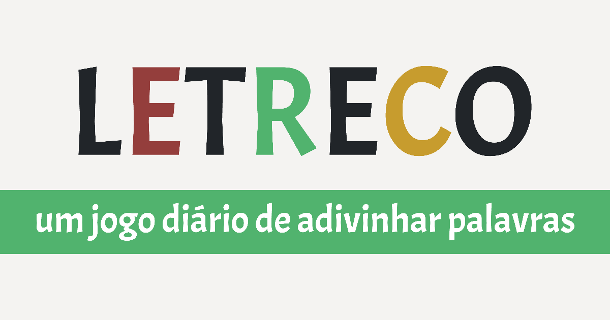

# Letreco - um jogo diário de adivinhar palavras

O [**Letreco**](https://gabtoschi.com/letreco) é um jogo web de adivinhação de palavras, criado como uma versão brasileira não-oficial do [Wordle](https://www.powerlanguage.co.uk/wordle/). Todos os dias, todos os jogadores que entram no site tem uma palavra de 5 letras para descobrir usando até 6 tentativas. Cada tentativa deve ser uma palavra válida e o jogo dá dicas a partir destes chutes, falando quais letras não estão na palavra ou se elas estão na posição correta na palavra.

Ele foi criado não só para que existisse uma versão em português do joguinho do momento, mas também para que eu pudesse praticar e aprender React. Dado o sucesso do Letreco, novas funcionalidades estão sendo adicionadas aos poucos.

O banco de dados de palavras é um recorte processado da lista usada pelo [VERO](https://pt-br.libreoffice.org/projetos/vero), o Verificador Ortográfico do LibreOffice para a língua portuguesa. Deixo aqui meus agradecimentos pela iniciativa e por ter quebrado aquele galho nesse projeto.

**Atenção:** se você quer jogar diariamente o jogo, não olhe o conteúdo do arquivo `dailyword.utils.ts`. Nele estão contidas todas as "palavras do dia" para, pelo menos, daqui 3 meses de jogo. Se você já saber a palavra, não tem muita graça em jogar, não é?

## Licença

O código-fonte do Letreco está disponível de forma aberta segundo a MIT License. Você pode redistribuir e modificar esse código, para uso privado, público ou comercial, **desde que você me credite (Gabriel Toschi)** pelo uso dele, se possível com um link para o meu site pessoal (https://gabtoschi.com). Inclusive, se você usá-lo pra estudar ou pra fazer a sua própria versão do jogo, eu ficaria muito feliz (mesmo) em saber, então não deixe de me contar! ;)

Entretanto, **a marca Letreco não está disponível para uso público**. Já temos uma comunidade em volta deste nome e toda e qualquer coisa que utilize o nome do Letreco deve ser feito com expressa autorização minha. Você pode acompanhar [o twitter oficial do Letreco](https://twitter.com/MeuLetreco) para ver tudo que é feito oficialmente por mim dentro do Letreco.